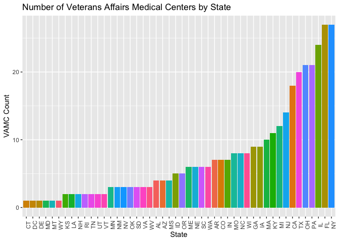
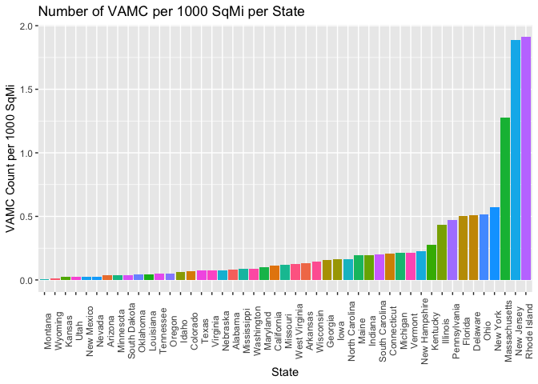
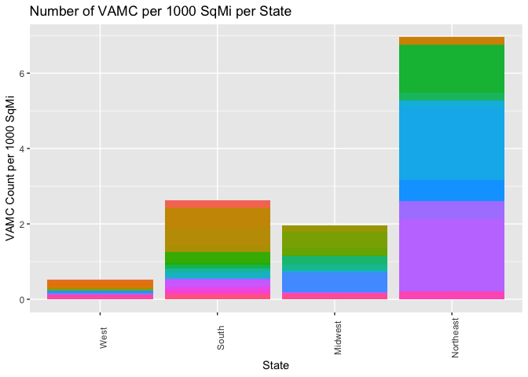

1b. Please create code which lists the State abbreviations without their counts, one abbreviation per State value. 
It does not have to be in data frame format. A vector is fine.
1c. Filter the data.frame from 1A. We are only interested in the Veterans Administration (VA) medical centers in the mainland United States—create a listing of counts of these centers by state, including only mainland locations. 
*Alaska, Hawaii, and U.S. territories should be omitted. DC, while not a state, is in the mainland, so it should remain included. Convert this to data.frame() 


```r
#replace LST column with cleaner data

load("/Users/mmastran/SMU/MSDS/github/MSDS/Unit06HW/N-MHSS-2015-DS0001-bndl-data-r/N-MHSS-2015-DS0001-data/N-MHSS-2015-DS0001-data-r.rda")
#str(mh2015_puf)
VAMC <- mh2015_puf


VAMC$LST <- trimws(as.character(VAMC$LST))
#replace FACILITYTYPE with cleaner data
VAMC$FACILITYTYPE <- as.numeric(VAMC$FACILITYTYPE)

#subset the dataframe with only the Veterans Affairs Medical Centers
VAMC <- subset.data.frame(VAMC, (FACILITYTYPE %in% "6"))

#Subset the dataframe with only the Continental US states
#Create vector of states to exclude
Excluded_States <- c("AK", "AS", "GU", "HI", "PR", "VI")
VAMC <- subset.data.frame(VAMC, !(LST %in% Excluded_States))

#Count Number of VAMC per state and rename columns
VAMC_State_Count <- count(VAMC, VAMC$LST)
colnames(VAMC_State_Count) <- c("State", "Number of VAMC")
#view(VAMC_State_Count, "US Mainland States with VA Medical Centers")
```

##d. Create a ggplot barchart of this filtered data set. 
	*Vary the bar’s colors by what State it has listed. 
	*Give it an appropriately professional title that is centered. 
	*Make sure you have informative axis labels. 
	*The State axis should be readable, not layered over each other. 
	*You’re welcome to have a legend or not.
	

```r
#Make States a factor in order to color bars of chart by state
VAMC_State_Count$State <- factor(VAMC_State_Count$State, levels = VAMC_State_Count$State)
#Plot the Number of VAMC per state and order
ggplot(VAMC_State_Count, aes(reorder(VAMC_State_Count$State, VAMC_State_Count$`Number of VAMC`), VAMC_State_Count$`Number of VAMC`)) + geom_bar(aes(fill=VAMC_State_Count$State), stat="identity") + ggtitle("Distribution of VA Medical Centers in continental US") + theme(axis.text.x=element_text(angle = 90, vjust = 1,hjust = ), legend.position="none") + scale_color_manual(values = LST) + labs(title="Number of Veterans Affairs Medical Centers by State", fill = "State", x= "State", y= "VAMC Count")
```

<!-- -->

#2. Cleaning and Bringing in New Features (60%) 
  
  a. This graph (1D) might be somewhat misleading, as bigger states may have more hospitals, but could be more sparsely located. 
  Read statesize.csv into your R environment. 
  This contains essentially a vector of square miles for each state. 
  In trying to merge it with your data.frame() from 1C, you find that they don’t match. 
  Use paste() on your LST column in 1C to see what the matter is, and write what you observe in a comment.
  	b. Correct the problem with the LST column using any method in R that is programmatic and easily understandable. 
	Once you have made these state abbreviations identical to statesize.csv’s Abbrev column, merge the data.frame() from 1C and statesize.csv in order to add size information. 
		c. Calculate a new variable in your combined data.frame() which indicates the VA hospitals per thousand square miles. 

```r
library(readr)
statesize <- read_csv("N-MHSS-2015-DS0001-bndl-data-r/N-MHSS-2015-DS0001-data/statesize.csv")
```

```
## Parsed with column specification:
## cols(
##   StateName = col_character(),
##   SqMiles = col_integer(),
##   Abbrev = col_character(),
##   Region = col_character()
## )
```

```r
#View(statesize)
str(statesize)
```

```
## Classes 'tbl_df', 'tbl' and 'data.frame':	50 obs. of  4 variables:
##  $ StateName: chr  "Alabama" "Alaska" "Arizona" "Arkansas" ...
##  $ SqMiles  : int  50750 570374 113642 52075 155973 103730 4845 1955 53997 57919 ...
##  $ Abbrev   : chr  "AL" "AK" "AZ" "AR" ...
##  $ Region   : chr  "South" "West" "West" "South" ...
##  - attr(*, "spec")=List of 2
##   ..$ cols   :List of 4
##   .. ..$ StateName: list()
##   .. .. ..- attr(*, "class")= chr  "collector_character" "collector"
##   .. ..$ SqMiles  : list()
##   .. .. ..- attr(*, "class")= chr  "collector_integer" "collector"
##   .. ..$ Abbrev   : list()
##   .. .. ..- attr(*, "class")= chr  "collector_character" "collector"
##   .. ..$ Region   : list()
##   .. .. ..- attr(*, "class")= chr  "collector_character" "collector"
##   ..$ default: list()
##   .. ..- attr(*, "class")= chr  "collector_guess" "collector"
##   ..- attr(*, "class")= chr "col_spec"
```

```r
colnames(statesize) <- c("State Name", "SqMiles", "State", "Region")
statesize <- subset.data.frame(statesize, !(State %in% Excluded_States))
statesize
```

```
## # A tibble: 48 x 4
##    `State Name` SqMiles State Region   
##    <chr>          <int> <chr> <chr>    
##  1 Alabama        50750 AL    South    
##  2 Arizona       113642 AZ    West     
##  3 Arkansas       52075 AR    South    
##  4 California    155973 CA    West     
##  5 Colorado      103730 CO    West     
##  6 Connecticut     4845 CT    Northeast
##  7 Delaware        1955 DE    South    
##  8 Florida        53997 FL    South    
##  9 Georgia        57919 GA    South    
## 10 Idaho          82751 ID    West     
## # ... with 38 more rows
```

```r
VAMC_State_Count <- merge(VAMC_State_Count, statesize)
VAMC_State_Count$`VAMC Per 1000mi` <- VAMC_State_Count$`Number of VAMC`/(VAMC_State_Count$SqMiles/1000)
VAMC_State_Count$`VAMC Per 1000mi` <- round(VAMC_State_Count$`VAMC Per 1000mi`, digits = 3)
```


  
  d. Create another ggplot which considers the VAs per square thousand miles, rather than just frequency. 
  • Make sure the State axis is readable, like before. Change the title and axes as appropriate. 
	• Modify the ggplot syntax to make your bars in descending order (there are StackOverflow topics for this, and I have demonstrated how in Live Coding in prior classes). 
	• Color-code the bars based on Region (see the merged data.frame)—however, change the color scheme from the default. Any set of colors is fine, so long as it is readable. 
	• Keep the legend—you should have four regions and therefore four colors. 
	

```r
VAMC_State_Count$`State Name` <- factor(VAMC_State_Count$`State Name`, levels = VAMC_State_Count$`State Name`)

ggplot(VAMC_State_Count, aes(reorder(VAMC_State_Count$`State Name`, VAMC_State_Count$`VAMC Per 1000mi`), VAMC_State_Count$`VAMC Per 1000mi`)) + geom_bar(aes(fill=VAMC_State_Count$`State Name`), stat="identity") + ggtitle("Density of VA Medical Centers Per US Continental State") + theme(axis.text.x=element_text(angle = 90, vjust = 1,hjust = ), legend.position="none") + scale_color_manual(values = `State Name`) + labs(title="Number of VAMC per 1000 SqMi per State", fill = "State", x= "State", y= "VAMC Count per 1000 SqMi")
```

<!-- -->

```r
ggplot(VAMC_State_Count, aes(reorder(VAMC_State_Count$Region, VAMC_State_Count$`VAMC Per 1000mi`), VAMC_State_Count$`VAMC Per 1000mi`)) + geom_bar(aes(fill=VAMC_State_Count$`State Name`), stat="identity") + ggtitle("Density of VA Medical Centers Per US Continental State") + theme(axis.text.x=element_text(angle = 90, vjust = 1,hjust = ), legend.position="none") + scale_color_manual(values = `State Name`) + labs(title="Number of VAMC per 1000 SqMi per State", fill = "State", x= "State", y= "VAMC Count per 1000 SqMi")
```

<!-- -->
	
	
#e. What patterns do you see? By this metric, is there any region that seems relatively high for VA medical centers per thousand square miles? How about low? Given these data, what advice might you give your boss before you start modeling (and why)?
	
## The NorthEast Region has an especially high density of VAMC per 1000 Square Miles.  The West has the lowest density of VAMC per 1000 Square Miles.  Given this could be due to the northeast having a higher population density per 1000 Square Miles, I might ask my boss ask that we add the population per 1000 square miles as a variable.  I might also consider adding the locations of US Military bases

https://github.com/mmastrangeli/MSDS/tree/master/Unit06HW 
