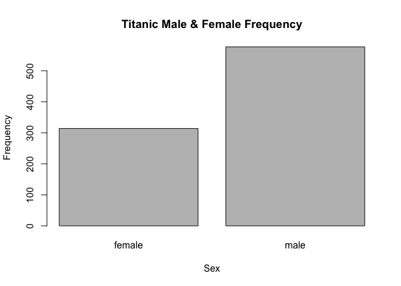

Live Session Unit 03 Assignment

##1.	 GitHub Cloning (20 points): Using Git, clone the following GitHub repository to your local machine: https://github.com/caesar0301/awesome-public-datasets.  In RMarkdown, please show the code (commented out, as it’s not R syntax) that you used to create a new directory, navigate to the appropriate directory, and clone the repository to it.  One Git command per line, please.

#Commenting out the following code because it has already run. 

```r
#Making sure that my working directory is set correctly to my github syncronized directory
#setwd("/Users/mmastran/SMU/MSDS/github/MSDS/unit03")
#Creating variable to store URL of awesome-public-datasets
#UrlAddress <- "https://github.com/caesar0301/awesome-public-datasets"
#Git Command to clone awesome-public-datasets to my MSDS/unit03 Github repository
#git2r::clone(url = UrlAddress, local_path = "/Users/mmastran/SMU/MSDS/github/MSDS/unit03/awesome-public-datasets")
```

##2.	Data Summary (20 points): 
#From this aforementioned cloned repo, please extract titanic.csv.zip.  To be clear, this does not have to be done in Git or command line.  
*a.	In R, please read in titanic.csv via either read.table() or read.csv(), assigning it to df.  This dataset follows the passengers aboard the Titanic, including their fees paid, rooms rented, and survivorship status.
*b.	Output the respective count of females and males aboard the Titanic. Plot the frequency of females and males.  Be sure to give an accurate title and label the axes.
*c.	Please use one apply function (to review: swirl() modules 11, 12) to output the means of Age, Fare, and Survival.  Make sure the output is a real number for all three means.


```r
#Creating variable to store path of the cloned awesome-public-datasets repo. I am sure there is a fancier way to code navigation from the cloned directory root to the sub directory that contains the titanic.csv.zip file. Would be great to improve this in that way. 
awesome_public_data_archive <- "/Users/mmastran/SMU/MSDS/github/MSDS/unit03/awesome-public-datasets/Datasets/titanic.csv.zip"
#extract titanic.csv from archive
unzip(awesome_public_data_archive)
```
##2a. In R, please read in titanic.csv via either read.table() or read.csv(), assigning it to df.  This dataset follows the passengers aboard the Titanic, including their fees paid, rooms rented, and survivorship status.

```r
##Read in titanic.csv using readcsv() and store in a data frame name 'titanic_data' then pass to the str() function for analysis of structure

#Store titanic.csv path in variable
titanic_csv_path <- "/Users/mmastran/SMU/MSDS/github/MSDS/unit03/titanic.csv"

#read in data from titanic.csv
titanic_data <- read.csv(titanic_csv_path)

#Confirm class of titanic_data and analyze Structure using str() function to identify column names 'variables', variance and number of observations.
str(titanic_data)
```

```
## 'data.frame':	891 obs. of  12 variables:
##  $ PassengerId: int  1 2 3 4 5 6 7 8 9 10 ...
##  $ Survived   : int  0 1 1 1 0 0 0 0 1 1 ...
##  $ Pclass     : int  3 1 3 1 3 3 1 3 3 2 ...
##  $ Name       : Factor w/ 891 levels "Abbing, Mr. Anthony",..: 109 191 358 277 16 559 520 629 417 581 ...
##  $ Sex        : Factor w/ 2 levels "female","male": 2 1 1 1 2 2 2 2 1 1 ...
##  $ Age        : num  22 38 26 35 35 NA 54 2 27 14 ...
##  $ SibSp      : int  1 1 0 1 0 0 0 3 0 1 ...
##  $ Parch      : int  0 0 0 0 0 0 0 1 2 0 ...
##  $ Ticket     : Factor w/ 681 levels "110152","110413",..: 524 597 670 50 473 276 86 396 345 133 ...
##  $ Fare       : num  7.25 71.28 7.92 53.1 8.05 ...
##  $ Cabin      : Factor w/ 148 levels "","A10","A14",..: 1 83 1 57 1 1 131 1 1 1 ...
##  $ Embarked   : Factor w/ 4 levels "","C","Q","S": 4 2 4 4 4 3 4 4 4 2 ...
```
##3b.	Output the respective count of females and males aboard the Titanic. Plot the frequency of females and males.  Be sure to give an accurate title and label the axes.

```r
#Load the plyr library for analysis and counting
library(plyr)

#extract Sex column of data and put in a vector
titanic_data_sex <- titanic_data$Sex

#display the titanic passenger sex dataframe
titanic_data_sex
```

```
##   [1] male   female female female male   male   male   male   female female
##  [11] female female male   male   female female male   male   female female
##  [21] male   male   female male   female female male   male   female male  
##  [31] male   female female male   male   male   male   male   female female
##  [41] female female male   female female male   male   female male   female
##  [51] male   male   female female male   male   female male   female male  
##  [61] male   female male   male   male   male   female male   female male  
##  [71] male   female male   male   male   male   male   male   male   female
##  [81] male   male   female male   female female male   male   female male  
##  [91] male   male   male   male   male   male   male   male   female male  
## [101] female male   male   male   male   male   female male   male   female
## [111] male   female male   female female male   male   male   male   female
## [121] male   male   male   female male   male   male   male   female male  
## [131] male   male   female female male   male   female male   male   male  
## [141] female female female male   male   male   male   female male   male  
## [151] male   female male   male   male   male   female male   male   male  
## [161] male   female male   male   male   male   female female male   male  
## [171] male   male   female male   male   male   male   female male   male  
## [181] female male   male   male   female male   female male   male   male  
## [191] female male   female male   female female male   male   female female
## [201] male   male   male   male   male   female male   male   female male  
## [211] male   female male   male   male   female female male   female male  
## [221] male   male   male   male   male   male   male   male   male   female
## [231] female male   male   female male   female male   female male   male  
## [241] female female male   male   male   male   female female male   male  
## [251] male   female male   male   female female female female female female
## [261] male   male   male   male   female male   male   male   female female
## [271] male   male   female male   female female female male   male   female
## [281] male   male   male   male   male   male   male   male   male   female
## [291] female female male   female male   male   male   female male   female
## [301] female male   male   female male   male   female female male   female
## [311] female female female male   male   female female male   female female
## [321] male   male   female female male   female male   female female female
## [331] female male   male   male   female male   male   female male   male  
## [341] male   female male   male   male   female female female male   male  
## [351] male   male   male   male   male   male   female female female female
## [361] male   male   female male   male   male   female female female female
## [371] male   male   male   male   female female female male   male   male  
## [381] female female male   female male   male   male   female male   female
## [391] male   male   male   female female male   female male   male   female
## [401] male   male   female male   female male   male   male   male   female
## [411] male   male   female male   male   female female female male   female
## [421] male   male   male   female male   male   female female male   male  
## [431] male   female female male   male   female female female male   male  
## [441] female male   male   female male   male   female male   female male  
## [451] male   male   male   male   male   male   male   female female male  
## [461] male   male   male   male   male   male   male   male   male   female
## [471] male   male   female female female male   male   male   male   female
## [481] male   male   male   female male   female female male   male   male  
## [491] male   male   male   male   male   male   female male   female male  
## [501] male   female female female female male   female male   male   male  
## [511] male   male   male   female male   male   female male   female male  
## [521] female male   male   female male   male   female male   male   male  
## [531] female male   male   female female female male   female male   female
## [541] female female female male   male   male   female male   male   male  
## [551] male   male   male   male   female male   female male   female female
## [561] male   male   male   male   female male   male   female male   male  
## [571] male   female male   female male   male   female female female male  
## [581] female female male   male   male   female male   male   male   male  
## [591] male   female male   female male   male   female male   male   male  
## [601] female male   male   male   male   male   male   male   female female
## [611] female male   female male   male   female male   female female male  
## [621] male   male   male   male   male   male   male   female male   male  
## [631] male   male   male   male   female female male   male   female male  
## [641] male   female female male   female male   male   male   male   female
## [651] male   female male   female female male   male   female male   male  
## [661] male   male   male   male   male   male   male   male   male   female
## [671] female male   male   male   male   male   male   female female male  
## [681] female male   male   male   male   male   male   male   male   female
## [691] male   female male   male   male   male   male   female male   male  
## [701] female male   female male   male   male   female male   female male  
## [711] female male   male   male   male   male   female female male   male  
## [721] female male   male   male   male   male   female female male   female
## [731] female male   male   male   male   male   female male   male   male  
## [741] male   male   female male   male   male   male   female male   male  
## [751] female male   male   male   female male   male   male   male   female
## [761] male   male   male   female male   female male   female male   male  
## [771] male   male   female male   female male   male   female male   female
## [781] female female male   male   male   male   female male   male   male  
## [791] male   male   female male   male   male   female female male   female
## [801] male   female male   male   male   male   male   female male   female
## [811] male   male   male   female male   male   female male   male   male  
## [821] female male   male   female male   male   male   male   male   female
## [831] female male   male   male   male   female male   male   male   male  
## [841] male   male   female male   male   male   male   male   male   female
## [851] male   male   female female female female female male   female male  
## [861] male   male   female female male   female female male   male   male  
## [871] male   female male   male   female female male   male   male   female
## [881] female male   female male   male   female male   female female male  
## [891] male  
## Levels: female male
```

```r
#Subset the vector into two vectors, male and female
#titanic_data_sex_male <- subset(titanic_data_sex, subset("male") == TRUE, select, drop = FALSE)
#titanic_data_sex_male

#Try using count function
count(titanic_data_sex)
```

```
##        x freq
## 1 female  314
## 2   male  577
```

```r
#count returns unique factors and frequency but does not plot well

plot(titanic_data_sex, main = "Titanic Male & Female Frequency", xlab = "Sex", ylab = "Frequency")
```

<!-- -->
## 3c.	Please use one apply function (to review: swirl() modules 11, 12) to output the means of Age, Fare, and Survival.  Make sure the output is a real number for all three means.

```r
#Using sapply() return the mean of the 'Age', 'Fare', 'Survived' variables. In order to nest a function in the sapply function, using list to return
#Had to add the na.rm argument in order to ignore NA entries in the data. 

lapply(list(titanic_data$Age, titanic_data$Fare, titanic_data$Survived), mean, na.rm=TRUE)
```

```
## [[1]]
## [1] 29.69912
## 
## [[2]]
## [1] 32.20421
## 
## [[3]]
## [1] 0.3838384
```

```r
#Trying the sapply function
sapply(list(titanic_data$Age, titanic_data$Fare, titanic_data$Survived), mean, simplify = TRUE, USE.NAMES = TRUE, na.rm=TRUE)
```

```
## [1] 29.6991176 32.2042080  0.3838384
```


4.	Function Building (30 points): You research sleep and just got your first data set.  Later, you’ll have another dataset with the same column names, so you want to create a helper function that you can analyze this dataset and the next.  Load sleep_data_01.csv (found at http://talklab.psy.gla.ac.uk/L1_labs/lab_1/homework/index.html).  Questions 3A through 3D should be answered in function(x){}.  3E can be outside of the function. 
*a.	Create objects for the median Age, the minimum and maximum Duration of sleep, and the mean and standard deviation of the Rosenberg Self Esteem scale (RSES).  You may need to specify a few options like in Problem 2 and live session.
*b.	Create a data.frame object called report: it should consist of the median age, the RSES mean and standard deviation respectively divided by five (since there are five questions and these scores are summed), and the range of Duration (the statistical definition of range; it should be a single number.)
*c.	Change the column names of this data.frame to MedianAge, SelfEsteem, SE_SD, and DurationRange.
*d.	Round the report to at most 2 digits: leave this as the closing line to the function.
*e.	Finally, run the function on your sleep data to show the output.


```r
#Download the file sleep_data_01.csv from http://talklab.psy.gla.ac.uk/L1_labs/lab_1/homework/index.html and store in a dataframe 'sleep_data

# Download and store data from sleep_data_01.csv and store in a dataframe 'sleep_data' 
sleep_data <- read.csv("http://talklab.psy.gla.ac.uk/L1_labs/lab_1/homework/sleep_data_01.csv")
str(sleep_data)
```

```
## 'data.frame':	101 obs. of  15 variables:
##  $ SubjID  : int  1 2 3 4 5 6 7 8 9 10 ...
##  $ Age     : int  16 16 16 16 16 16 16 13 12 16 ...
##  $ Gender  : int  2 1 1 1 1 1 1 1 1 2 ...
##  $ PSQI    : int  5 4 7 6 8 15 7 4 5 4 ...
##  $ PSAScog : int  8 31 9 17 33 NA 27 13 14 11 ...
##  $ FOMO    : int  18 41 16 22 36 NA 15 17 25 16 ...
##  $ SMUISa  : int  19 25 17 14 NA NA 20 9 15 7 ...
##  $ SM1     : int  11 18 16 17 NA NA 21 17 17 13 ...
##  $ SM2     : int  12 21 14 13 NA NA 24 2 7 11 ...
##  $ HADSa   : int  10 20 7 9 NA NA 13 9 10 4 ...
##  $ HADSd   : int  8 8 3 5 NA NA 6 7 5 2 ...
##  $ RSES    : int  17 5 17 12 NA NA 22 22 21 21 ...
##  $ Bedtime : num  10 10 10.5 10.5 11 ...
##  $ Latency : int  20 30 20 30 30 20 15 5 30 20 ...
##  $ Duration: num  10 9 7.5 7 6 4 6 11 8.5 8 ...
```

##4a.	Create objects for the median Age, the minimum and maximum Duration of sleep, and the mean and standard deviation of the Rosenberg Self Esteem scale (RSES).  You may need to specify a few options like in Problem 2 and live session.

```r
sleep_data_age <- sleep_data$Age
sleed_data_duration <- sleep_data$Duration
sleep_data_RSES <- sleep_data$RSES

#sleep_data_age
#sleed_data_duration
#sleep_data_RSES

sleep_data_age_median <- median(sleep_data_age, na.rm=TRUE)
sleed_data_duration_min <- min(sleed_data_duration, na.rm=TRUE)
sleed_data_duration_max <- max(sleed_data_duration, na.rm=TRUE)
sleep_data_RSES_mean <- mean(sleep_data_RSES, na.rm=TRUE)
sleep_data_RSES_sd <- sd(sleep_data_RSES, na.rm=TRUE)

sleep_data_age_median
```

```
## [1] 14
```

```r
sleed_data_duration_min
```

```
## [1] 4
```

```r
sleed_data_duration_max
```

```
## [1] 11
```

```r
sleep_data_RSES_mean
```

```
## [1] 18.11494
```

```r
sleep_data_RSES_sd
```

```
## [1] 6.176522
```
## 4b.	Create a data.frame object called report: 
#it should consist of the median age, the RSES mean and standard deviation respectively divided by five (since there are five questions and these scores are summed), 
#and the range of Duration (the statistical definition of range; it should be a single number.)

```r
#DivBy2 <- function(x){x/2}
report <- round(c(c(sleep_data_age_median, sleep_data_RSES_mean, sleep_data_RSES_sd)/5, range(sleep_data$Duration, na.rm = TRUE)))

report
```

```
## [1]  3  4  1  4 11
```

##4c.	Change the column names of this data.frame to MedianAge, SelfEsteem, SE_SD, and DurationRange.


##4d.	Round the report to at most 2 digits: leave this as the closing line to the function.

##4e.	Finally, run the function on your sleep data to show the output.


5.	FiveThirtyEight Data (30 points): Navigate on GitHub to https://github.com/rudeboybert/fivethirtyeight and read README.md. It will include everything you need. 
*a.	Install the fivethirtyeight package.
*b.	In the listing of Data sets in package ‘fivethirtyeight,’ assign the 22nd data set to an object ‘df.’
*c.	Use a more detailed list of the data sets to write out the URL in a comment to the related news story.
*d.	Using R command(s), give the dimensions and column names of this data frame.
##
## 5a.	Install the fivethirtyeight package.

```r
#Making sure that my working directory is set correctly to my github syncronized directory
#setwd("/Users/mmastran/SMU/MSDS/github/MSDS/unit03")
#Creating variable to store URL of FiveThirtyEight
#UrlAddress <- "https://github.com/rudeboybert/fivethirtyeight"
#list(UrlAddress)
#Git Command to clone FiveThirtyEight to my MSDS/unit03/FiveThirtyEight Github repository
#git2r::clone(url = UrlAddress, local_path = "/Users/mmastran/SMU/MSDS/github/MSDS/unit03/FiveThirtyEight")
#install.packages("fivethirtyeight")
#library(fivethirtyeight)
```

#*b.	In the listing of Data sets in package ‘fivethirtyeight,’ assign the 22nd data set to an object ‘df.’

6.	Data Summary (30 points): Use your newly assigned data frame from question 4 for this question. 
*a.	Write an R command that gives you the column names of the data frame.  Right after that, write one that counts the number of columns but not rows.  Hint: The number should match one of your numbers in Question 1d for dimensions.
*b.	Generate a count of each unique major_category in the data frame.  I recommend using libraries to help.  To be clear, this should look like a matrix or data frame containing the major_category and the frequency it occurs in the dataset.  Assign it to major_count.
*c.	To make things easier to read, put par(las=2) before your plot to make the text perpendicular to the axis.  Make a barplot of major_count.  Make sure to label the title with something informative (check the vignette if you need), label the x and y axis, and make it any color other than grey.  Assign the major_category labels to their respective bar.  Flip the barplot horizontally so that bars extend to the right, not upward.  All of these options can be done in a single pass of barplot(). Note: It’s okay if it’s wider than the preview pane.
*d.	Write the fivethirtyeight data to a csv file.  Make sure that it does not have row labels.


7.	Codebook (30 points): 
*a.	Start a new repository on GitHub for your SMU MSDS homework.  On your local device, make sure there is a directory for Homework at the minimum; you are welcome to add whatever you would like to this repo in addition to your requirements here.
*b.	Create a README.md file which explains the purpose of the repository, the topics included, the sources for the material you post, and contact information in case of questions. Remember, the one in the root directory should be general.  You are welcome to make short READMEs for each assignment individually in other folders.
*c.	In one (or more) of the nested directories, post your RMarkdown script, HTML file, and data from ‘fivethirtyeight.’  Make sure that in your README or elsewhere that you credit fivethirtyeight in some way.
*d.	In your RMarkdown script, please provide the link to this GitHub so the grader can see it.

##https://github.com/mmastrangeli/MSDS/tree/master/unit03

